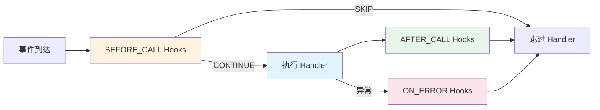

# Hook 基础

> NcatBot 的请求处理中间件——在事件处理器执行前后拦截、过滤、增强行为。

---

## 目录

- [概述](#概述)
- [Hook 三阶段模型](#hook-三阶段模型)
- [HookContext 上下文](#hookcontext-上下文)
- [编写自定义 Hook](#编写自定义-hook)

---

## 概述

Hook 是 NcatBot 的中间件机制，可以在事件处理器（Handler）执行的不同阶段插入逻辑：



常见用途：
- **过滤**：按消息类型、关键词、权限等条件拦截事件
- **日志**：记录所有命令的执行情况
- **错误处理**：捕获异常并自动通知用户
- **参数注入**：从消息中提取参数传递给 Handler

---

## Hook 三阶段模型

| 阶段 | `HookStage` | 触发时机 | 可返回的 Action |
|------|------------|---------|----------------|
| **前置** | `BEFORE_CALL` | Handler 执行**之前** | `CONTINUE`（继续）/ `SKIP`（跳过 Handler） |
| **后置** | `AFTER_CALL` | Handler 执行**之后** | `CONTINUE` |
| **错误** | `ON_ERROR` | Handler 执行**异常**时 | `CONTINUE` |

### HookAction

```python
from ncatbot.core.registry.hook import HookAction

HookAction.CONTINUE  # 继续执行后续 Hook / Handler
HookAction.SKIP      # 跳过当前 Handler（仅 BEFORE_CALL 有效）
```

---

## HookContext 上下文

每个 Hook 的 `execute()` 方法接收一个 `HookContext`，包含当前事件处理的完整上下文：

| 字段 | 类型 | 说明 |
|------|------|------|
| `ctx.event` | `Event` | 当前事件 |
| `ctx.event_type` | `str` | 事件类型字符串 |
| `ctx.handler_entry` | `HandlerEntry` | 处理器注册信息（含 `func` 属性） |
| `ctx.api` | `BotAPIClient` | Bot API 客户端 |
| `ctx.services` | `ServiceManager` | 服务管理器（可选） |
| `ctx.kwargs` | `Dict[str, Any]` | Hook 间共享的参数字典 |
| `ctx.result` | `Any` | Handler 返回值（仅 AFTER_CALL） |
| `ctx.error` | `Exception` | 异常信息（仅 ON_ERROR） |

---

## 编写自定义 Hook

### 基本结构

```python
from ncatbot.core.registry.hook import Hook, HookAction, HookContext, HookStage

class MyHook(Hook):
    stage = HookStage.BEFORE_CALL  # 选择阶段
    priority = 50                   # 优先级（越大越先执行）

    async def execute(self, ctx: HookContext) -> HookAction:
        # 你的逻辑
        return HookAction.CONTINUE  # 或 HookAction.SKIP
```

### 完整示例：三个自定义 Hook

以下示例展示了三种阶段的 Hook——关键词过滤、日志记录、错误通知：

```python
from ncatbot.core.registry.hook import (
    Hook, HookAction, HookContext, HookStage, add_hooks,
)
from ncatbot.types import MessageArray

BLOCKED_WORDS = ["违禁词", "广告", "spam"]


class KeywordFilterHook(Hook):
    """BEFORE_CALL: 检查消息是否包含屏蔽词"""

    stage = HookStage.BEFORE_CALL
    priority = 50

    async def execute(self, ctx: HookContext) -> HookAction:
        message = getattr(ctx.event.data, "message", None)
        if message is None:
            return HookAction.CONTINUE
        text = message.text if hasattr(message, "text") else ""
        for word in BLOCKED_WORDS:
            if word in text:
                LOG.info("消息被屏蔽词过滤: %s", text)
                return HookAction.SKIP  # 跳过 Handler
        return HookAction.CONTINUE


class LoggingHook(Hook):
    """AFTER_CALL: 记录命令执行日志"""

    stage = HookStage.AFTER_CALL
    priority = 0

    async def execute(self, ctx: HookContext) -> HookAction:
        handler_name = ctx.handler_entry.func.__name__
        user_id = getattr(ctx.event.data, "user_id", "unknown")
        LOG.info("[日志] %s 被 %s 成功执行", handler_name, user_id)
        return HookAction.CONTINUE


class ErrorNotifyHook(Hook):
    """ON_ERROR: 异常时自动回复错误信息"""

    stage = HookStage.ON_ERROR
    priority = 0

    async def execute(self, ctx: HookContext) -> HookAction:
        error = ctx.error
        LOG.error("[错误] handler 异常: %s", error)
        api = ctx.api
        data = ctx.event.data
        if api and hasattr(data, "group_id"):
            try:
                msg = MessageArray()
                msg.add_text(f"⚠️ 命令执行出错: {type(error).__name__}")
                await api.post_group_array_msg(data.group_id, msg)
            except Exception:
                pass
        return HookAction.CONTINUE
```

> 取自 [examples/06_hook_and_filter/main.py](../../../examples/06_hook_and_filter/main.py)

### 附加 Hook 到 Handler

有两种方式将 Hook 附加到处理器：

**方式一：`@add_hooks()` 批量绑定**

```python
keyword_filter = KeywordFilterHook()
logging_hook = LoggingHook()
error_notify = ErrorNotifyHook()

@add_hooks(keyword_filter, logging_hook, error_notify)
@registrar.on_group_command("回声")
async def on_echo(self, event: GroupMessageEvent, content: str):
    """经过关键词过滤 + 日志记录 + 错误捕获"""
    await event.reply(f"🔊 {content}")
```

**方式二：`@hook` 装饰器语法**

```python
@error_notify
@registrar.on_group_command("除零")
async def on_divide_by_zero(self, event: GroupMessageEvent):
    """故意触发异常，演示 ON_ERROR Hook"""
    _ = 1 / 0
```

> 取自 [examples/06_hook_and_filter/main.py](../../../examples/06_hook_and_filter/main.py)

---

## 下一步

- [内置 Hook 与参数绑定](6b.hook-builtins.md) — 内置 Hook 清单、CommandHook、优先级
- [事件注册与装饰器](4a.event-registration.md) — Hook 如何与装饰器注册配合工作
