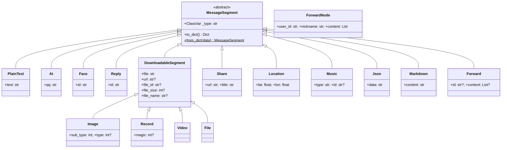

# 发送消息指南

> 从快速发送到精细构造，NcatBot 的完整消息发送参考。

---

## 目录

| # | 文档 | 内容 |
|---|---|---|
| 1 | [快速上手](1_quickstart.md) | `event.reply()` / `post_group_msg` 关键字语法 / `MessageArray` 入门 |
| 2 | [消息段参考](2_segments.md) | 所有消息段类型：基础、多媒体、富文本 |
| 3 | [MessageArray 消息数组](3_array.md) | 容器：创建、链式构造、查询过滤、序列化 |
| 4 | [合并转发](4_forward.md) | `ForwardNode` / `Forward` / `ForwardConstructor` 构造器 |
| 5 | [便捷接口参考](5_sugar.md) | `event.reply()`、所有 sugar 方法、`send_poke` 完整清单 |
| 6 | [实战示例](6_examples.md) | 14 个场景：纯文本、图文、回复、文件、视频、转发、戳一戳等 |

---

## 发送方式速查

| 方式 | 适用场景 | 示例 |
|---|---|---|
| `event.reply(text=...)` | 最快回复（自动引用 + @发送者） | `await event.reply(text="收到！")` |
| `post_group_msg(gid, text=..., image=...)` | 关键字快捷发送 | `await self.api.post_group_msg(gid, text="Hi", image="a.png")` |
| `post_group_array_msg(gid, msg)` | 发送自定义 MessageArray | `await self.api.post_group_array_msg(gid, msg)` |
| `send_group_text(gid, text)` | 单独发文本 | `await self.api.send_group_text(gid, "Hello")` |
| `send_group_image(gid, image)` | 单独发图片 | `await self.api.send_group_image(gid, "a.png")` |
| `send_group_file(gid, file)` | 发送文件 | `await self.api.send_group_file(gid, "doc.pdf")` |
| `post_group_forward_msg(gid, fwd)` | 合并转发 | `await self.api.post_group_forward_msg(gid, forward)` |

> 以上群方法均有对应的私聊版本（`post_private_msg`、`send_private_text` 等）。

## 概念总览

NcatBot 遵循 **OneBot v11** 消息协议。每条消息由若干**消息段（MessageSegment）**组成，每个消息段有 `type` 和 `data`：

```json
{"type": "text", "data": {"text": "Hello"}}
{"type": "image", "data": {"file": "https://example.com/img.png"}}
```

多个消息段组成**消息数组（MessageArray）**：

```json
[
  {"type": "text", "data": {"text": "看这张图 "}},
  {"type": "image", "data": {"file": "https://example.com/img.png"}}
]
```

## 消息段类图



类型注册是自动完成的：当子类定义了 `_type` 类属性时，会自动注册到全局 `SEGMENT_MAP`，从而支持 `parse_segment()` 自动解析。

---

## 消息段类型速查表

| 类型标识 | 类名 | 说明 | 详细文档 |
|---|---|---|---|
| `text` | `PlainText` | 纯文本 | [2_segments.md](2_segments.md#plaintext--纯文本) |
| `at` | `At` | @某人 / @全体 | [2_segments.md](2_segments.md#at--某人) |
| `face` | `Face` | QQ 表情 | [2_segments.md](2_segments.md#face--qq-表情) |
| `reply` | `Reply` | 回复引用 | [2_segments.md](2_segments.md#reply--回复消息) |
| `image` | `Image` | 图片 | [2_segments.md](2_segments.md#image--图片) |
| `record` | `Record` | 语音 | [2_segments.md](2_segments.md#record--语音) |
| `video` | `Video` | 视频 | [2_segments.md](2_segments.md#video--视频) |
| `file` | `File` | 文件 | [2_segments.md](2_segments.md#file--文件) |
| `share` | `Share` | 链接分享 | [2_segments.md](2_segments.md#share--链接分享) |
| `location` | `Location` | 定位 | [2_segments.md](2_segments.md#location--定位) |
| `music` | `Music` | 音乐 | [2_segments.md](2_segments.md#music--音乐) |
| `json` | `Json` | JSON 卡片 | [2_segments.md](2_segments.md#json--json-消息) |
| `markdown` | `Markdown` | Markdown | [2_segments.md](2_segments.md#markdown--markdown-消息) |
| `forward` | `Forward` | 合并转发 | [4_forward.md](4_forward.md) |

所有类型均可从 `ncatbot.types.segment` 统一导入：

```python
from ncatbot.types.segment import (
    PlainText, Face, At, Reply,
    Image, Record, Video, File,
    Share, Location, Music, Json, Markdown,
    Forward, ForwardNode,
    MessageArray,
)
```
